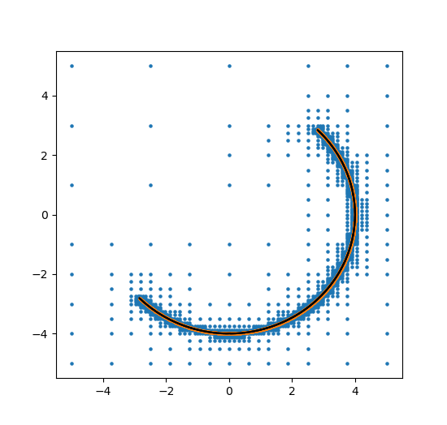

# MDBM.jl

[](http://numfocus.org)

Multi-Dimensional Bisection Method (MDBM) is an efficient and robust root-finding algorithm, which can determine whole high-dimensional submanifolds (points, curves, surfaces…) of the roots of implicit non-linear equation systems, even in cases, where the number of unknowns surpasses the number of equations.

<a href="https://www.codecogs.com/eqnedit.php?latex=f_i(x_j)=0&space;\quad&space;i=1...k&space;\quad&space;j=1...l,&space;\quad&space;k&space;\leq&space;l" target="_blank"></a>

This type of problems can be found in many different field of science 
- differential geometry (isolines, isosurfaces in higher dimensions)
- linkage (mechanical: workspace of robots)
- stability computation, stabilyzability diagrams


This function is an alternative of the contour plot or the isosurface in higher dimension, however, as a main advantage: it can handle multiple functions. <br>
In additional uses much less function evaluation than the brute-force method, so for complex task it is much faster and use fare less memory.


## Introduction

The bisection method - or the so-called interval halving method - is one of the simplest root-finding algorithms which is used to find zeros of continuous non-linear functions.
This method is very robust and it always tends to the solution if the signs of the function values are different at the borders of the chosen initial interval.

Geometrically, root-finding algorithms of f(x)=0 find one intersection point of the graph of the function with the axis of the independent variable.
In many applications, this 1-dimensional intersection problem must be extended to higher dimensions, e.g.: intersections of surfaces in a 3D space (volume), which can be described as a system on non-linear implicit equations. In higher dimensions, the existence of multiple solutions becomes very important, since the intersection of two surfaces can create multiple intersection curves.

MDBM algorithm canhandle automatically:
- multiple solutions 
- arbitrary number of parameter (typically: 3-6)
- arbitrary number implicit equations
- multiple constraints in the parameter space
- handle degenerated functions
- first order interpolation (and convergence rate)
- provides the gradients of the equations for the roots


## Citing
The software in this ecosystem was developed as part of academic research. If you use the MDBM.jl package as part of your research, teaching, or other work, I would be grateful if you could cite my corresponding publication: <https://pp.bme.hu/me/article/view/1236/640>


## Web:
<https://www.mm.bme.hu/~bachrathy/research_EN.html>

# Quick start

Preparation
```julia
include("MDBM.jl")
using Reexport
@reexport using .MDBM
```

```julia
using PyPlot;
pygui(true);
```
Computation of a circle defined the implicit equtaion `foo` considering a constratint `c`
```julia
function foo(x,y)
    x^2.0+y^2.0-2.0^2.0
end
function c(x,y)
    x-y
end

ax1=Axis([-5,-2.5,0,2.5,5],"x")
ax2=Axis(-5:2:5.0,"b")

mymdbm=MDBM_Problem(foo,[ax1,ax2],constraint=c)
iteration=5 #number of refinements (resolution doubling)
solve!(mymdbm,iteration)


#evaluated points
x_eval,y_eval=getevaluatedpoints(mymdbm)

#solution points
x_sol,y_sol=getinterpolatedsolution(mymdbm)

fig = figure(1);clf()
scatter(x_eval,y_eval,s=5)
scatter(x_sol,y_sol,s=5)
```

Perform the line connection
```julia
myDT1=connect(mymdbm);
for i in 1:length(myDT1)
    dt=myDT1[i]
    P1=getinterpolatedsolution(mymdbm.ncubes[dt[1]],mymdbm)
    P2=getinterpolatedsolution(mymdbm.ncubes[dt[2]],mymdbm)
    plot([P1[1],P2[1]],[P1[2],P2[2]], color="k")
end 
```




Intersection of two sphere in 3D
```julia
using LinearAlgebra
axes=[-2:2,-2:2,-2:2]
fig = figure(3);clf()


#Sphere1
fS1=(x...)->norm([x...],2.0)-1
Sphere1mdbm=MDBM_Problem(fS1,axes)
solve!(Sphere1mdbm,4)
a_sol,b_sol,c_sol=getinterpolatedsolution(Sphere1mdbm)
plot3D(a_sol,b_sol,c_sol,linestyle="", marker=".", markersize=1);


#Sphere2
fS2=(x...)->norm([x...] .- 0.5,2.0) -1.0
Sphere2mdbm=MDBM_Problem(fS2,axes)
solve!(Sphere2mdbm,4)
a_sol,b_sol,c_sol=getinterpolatedsolution(Sphere2mdbm)
plot3D(a_sol,b_sol,c_sol,linestyle="", marker=".", markersize=1);

fS12=(x...)->[fS1(x...),fS2(x...)]
Intersectmdbm=MDBM_Problem(fS12,axes)
solve!(Intersectmdbm,6)

#Intersection
a_sol,b_sol,c_sol=getinterpolatedsolution(Intersectmdbm)
plot3D(a_sol,b_sol,c_sol,color="k",linestyle="", marker=".", markersize=2);

```


Example for a non-smooth problem (Mandelbrot set)

```julia
fig = figure(4);clf()
function mandelbrot(x,y)    
    c=x+y*1im
    z=Complex(0)
    k=0
    maxiteration=1000
    while (k<maxiteration && abs(z)<4.0)
            z=z^2+c
            k=k+1
        end
    return abs(z)-2.0 #(k==maxiteration)# && abs(z)<2.0)#abs(z)<2.0
end

Mandelbrotmdbm=MDBM_Problem(mandelbrot,[-5:2,-2:2])
solve!(Mandelbrotmdbm,9)
a_sol,b_sol=getinterpolatedsolution(Mandelbrotmdbm)
plot(a_sol,b_sol,linestyle="", marker=".", markersize=1);
```


## History

I am an assistant professor at the Budapest University of Technology and Economics, at the Faculty of Mechanical Engineering, the Department of Applied Mechanics.
During my studies and research, I have to determine stability charts of models described by delayed differential equations, which are typically formed as a "3 parameter / 2 implicit equation" problem. I have faced the difficulty that there is no applicable solution in any available software (e.g.: Mathematica, Matlab,...) which could easily be used in engineering problems. 
Due to this reason, I have started to develop the Multi-Dimensional Bisection Method sice 2006 in Matlab. It has been slowly improved by adding new features.

Best regards,
Dr. Daniel Bachrathy

#


MDBM is a fiscally sponsored project of [NumFOCUS](https://numfocus.org), a
nonprofit dedicated to supporting the open source scientific computing
community.

## Licence: CC BY-NC-ND Licence 
I would like to keep the developement in my hand, but I wellcome all the comments. <br>
<https://creativecommons.org/licenses/by-nc-nd/2.0/>


